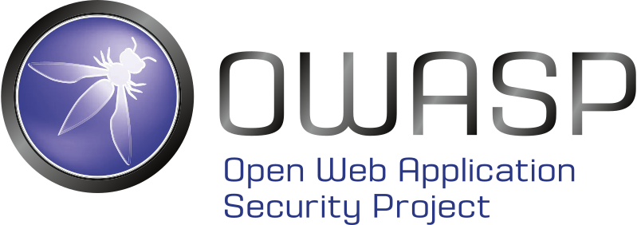
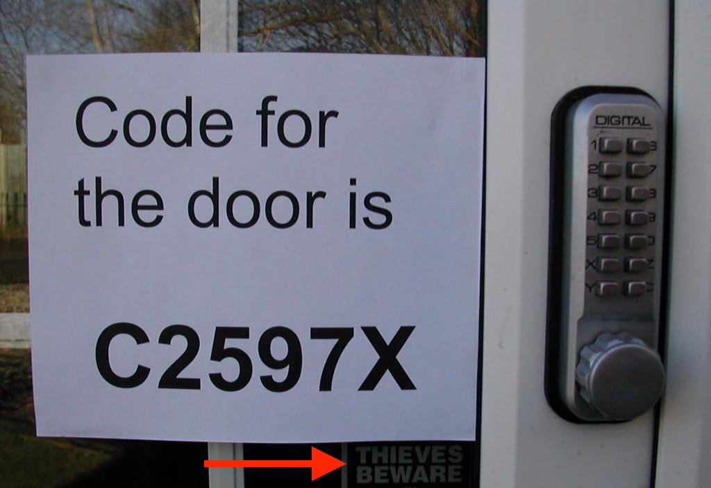
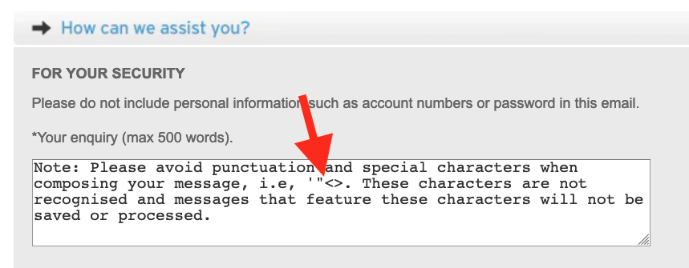
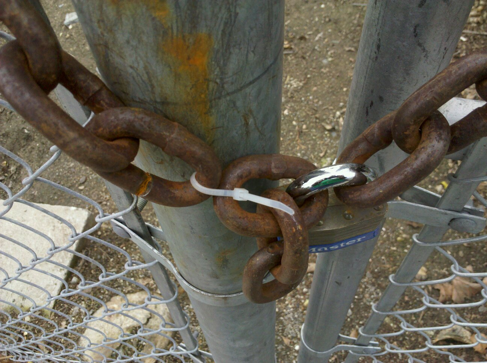
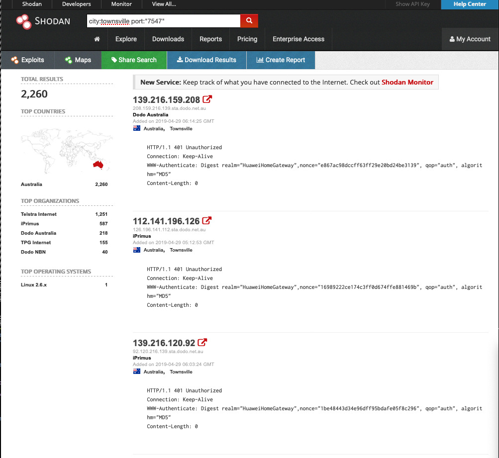
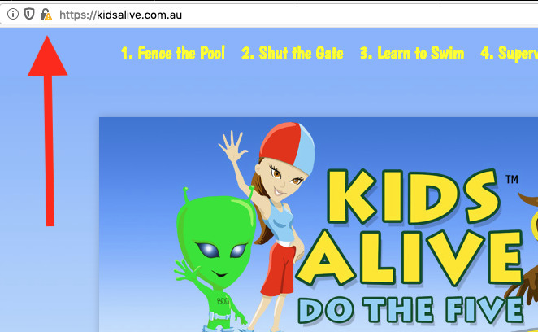

### Preventing kids drowning   is _vitally important_

Notes:
* Who's heard of Kids Alive Do the Five?

---

<!-- .slide: data-background="#000" data-transition="fade" -->
<video controls class="plain stretch">
  <source src="media/kids-alive-cut.mp4" type="video/mp4" />
</video>

---

## Turns out...

Notes:
* Started in 1988 by Laurie Lawrence
  * Townsville-born Olympic Swim Coach
* Aside from really catchy videos,
* There's a message there

---

### ...they've actually been teaching _IT security_ all these years

---

<!-- .slide: data-background-transition="fade" data-transition="fade" -->
## `type(self)`

* David Beitey (@davidjb)
* Many hats 🧢🎩👒 
* DevOps, SysAdmin, Security Researcher...

---

 <!-- .element class="plain logo" -->

### Top 10

Critical Web App Security Risks*   (*Abridged)

---

<!-- .slide: data-background="#000" data-transition="fade" -->

 <!-- .element class="plain logo" -->

---

# 5.
### Fence the (thread) pool

### Broken Authentication
and
### Broken Access Control

 <!-- .element class="plain stretch"-->

### Vectors

* Known credentials:
  * `admin` <!-- .element style="color: red;" --> / `password` <!-- .element style="color: blue;" --> or data breaches
* Password-only auth
* URLs accessible without permission https://bank.com/payPerson?name=David&amount=EVERYTHING
* Cross-Site Request Forgeries (CSRF)

### Prevention

* *Immediately* change default credentials
* Enforce multi-factor auth (users + servers)
* Rate limit logins
* Principle of least privilege
* Validate actions with tokens

---

# 4.
### Shut the (logic) gate

## Injection
aka
#### Untrusted input that manipulates your system/users
#### (SQLi + XSS)

 <!-- .element class="plain stretch"-->
#### Big 4 bank, right now

### Attacks

<a href="#">
https://example.com/contact.php ?name=Robert'); DROP TABLE Students;--
</a>

<a href="#">
https://example.com/search ?query=&lt;script&gt;alert('xss')&lt;script&gt;
</a>

 

**Aim:** get raw SQL to the database or raw JS/HTML/CSS onto a page

### Prevention

* Always treat data as untrusted
* Santise/filter/validate via whitelists
* Use frameworks & platforms with built-in security (eg not raw PHP)
* Monitoring & user awareness

---

# 3.
### Teach your (apps) to (HTTPS)wim

## Sensitive Data Exposure
aka
### Lack of data protection

### Vectors

* Not using TLS (eg `http://`)
* Storing plain-text credentials
* Weakly protected storage (S3 buckets, open databases)...

 <!-- .element class="plain stretch"-->

### Prevention

* Always use HTTPS (free certs/Let's Encrypt)
* Avoid storing data unless *necessary*
* Don't roll your own crypto
* Use best practices (eg Django/Rails), esp. for sensitive data

---

# 2.
### Supervise (deps)

## Known Vulnerabilities
aka
### Unpatched systems, unmaintained/untrusted code

 <!-- .element class="plain stretch" -->

[shodan.io](https://shodan.io)

Notes:
* Shodan is a search engine for devices
* Can easily be used to hunt for vulnerabilities
  * Vulnerability lists (CVEs)
* This shows 2000+ modems in Townsville open to the Internet.
* Oops

### Prevention

* Update, monitor & patch *everything* (with testing!)
* Remove unnecessary code
* Use only official, secure software
* Monitor CVE lists & use tools for checking dependencies
* Security-by-obscurity **not** okay

---

# 1.
### Learn how to   (escalate)

## Logging & Monitoring
aka
### Insufficient awareness of suspicious activity

### Prevention

* Logging with sufficient context
* Monitoring and alerting *humans*
* Create a response/recovery plan

---

 <!-- .element class="plain logo" -->

* Security is hard
* You won’t stop everything: forward planning
* Many more than 5 or 10 risks
* Easy wins with limited budgets
* Follow best practices

---

### MOAR

* OWASP Top 10 PDF ([owasp.org](https://owasp.org))
* Security Weakest Link Game (https://www.isdecisions.com/user-security-awareness-game/)
* Google's https://xss-game.appspot.com/
* DEF CON presentations ([defcon.org](https://defcon.org))

---

### Presentation @
https://github.com/davidjb/devs-alive/

---

 <!-- .element class="plain stretch"-->

Broken HTTPS + Flash + Data leaks + CSRF + ???

_Maybe don't trust their IT experience_

---

<!-- .slide: data-background="#000" data-transition="fade" -->

 <!-- .element class="plain logo" -->

Notes:
* And you should learn to swim & how to do CPR if you don't already know
